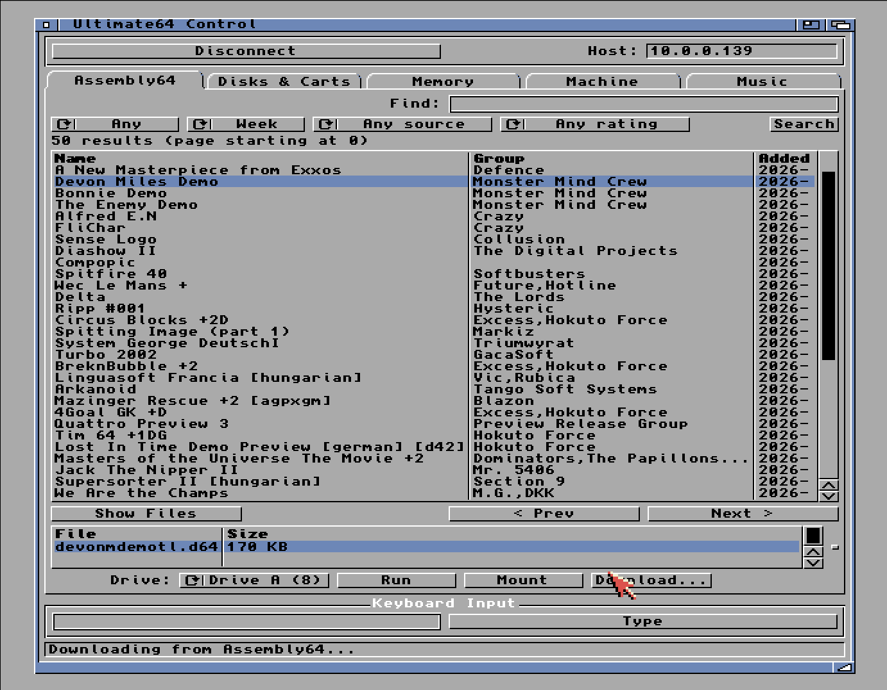

# Ultimate64 Manager & SID Player for AmigaOS 3.x

Control an [Commodore 64 Ultimate / Ultimate-II](https://ultimate64.com/) from a classic Amiga over the network.

Three apps built from one library:

- **u64mui** — MUI GUI with tabs for disks/carts, memory, machine, music, and an Assembly64 browser (search CSDB/HVSC/OneLoad64, download and run straight to the device).
- **u64cli** — shell tool for scripts and one-liners (reset, load, mount, peek/poke, play SID/MOD, type text).
- **u64player** — MUI SID player with playlist and HVSC songlengths support.

## Download

- [Aminet: comm/misc/u64ctl](https://aminet.net/package/comm/misc/u64ctl)
- [GitHub Releases](https://github.com/sandlbn/u64ctl/releases)

## Screenshots



## Build

Requires the [bebbo/amiga-gcc](https://github.com/bebbo/amiga-gcc) cross-compiler.

```sh
make            # build everything
make mui        # or: cli, player, library
```

Docker one-liner (no local toolchain):

```sh
docker run --rm -v "${PWD}:/work" sacredbanana/amiga-compiler:m68k-amigaos make
```

Binaries land in `out/`.

## Configure

Set the Ultimate's address once via env-vars (persists in `ENV:Ultimate64/`):

```
u64cli sethost HOST 10.0.0.64
u64cli setpassword PASSWORD secret
```

`u64mui` and `u64player` read the same settings and also have a Settings dialog.

## Credits

- Gideon Zweijtzer — Ultimate64/II hardware.
- [ultimate64 Rust crate](https://docs.rs/ultimate64/) — API reference.
- [HVSC](https://www.hvsc.c64.org/) — song lengths.
- [Assembly64](https://hackerswithstyle.se/leet/) — search index.
